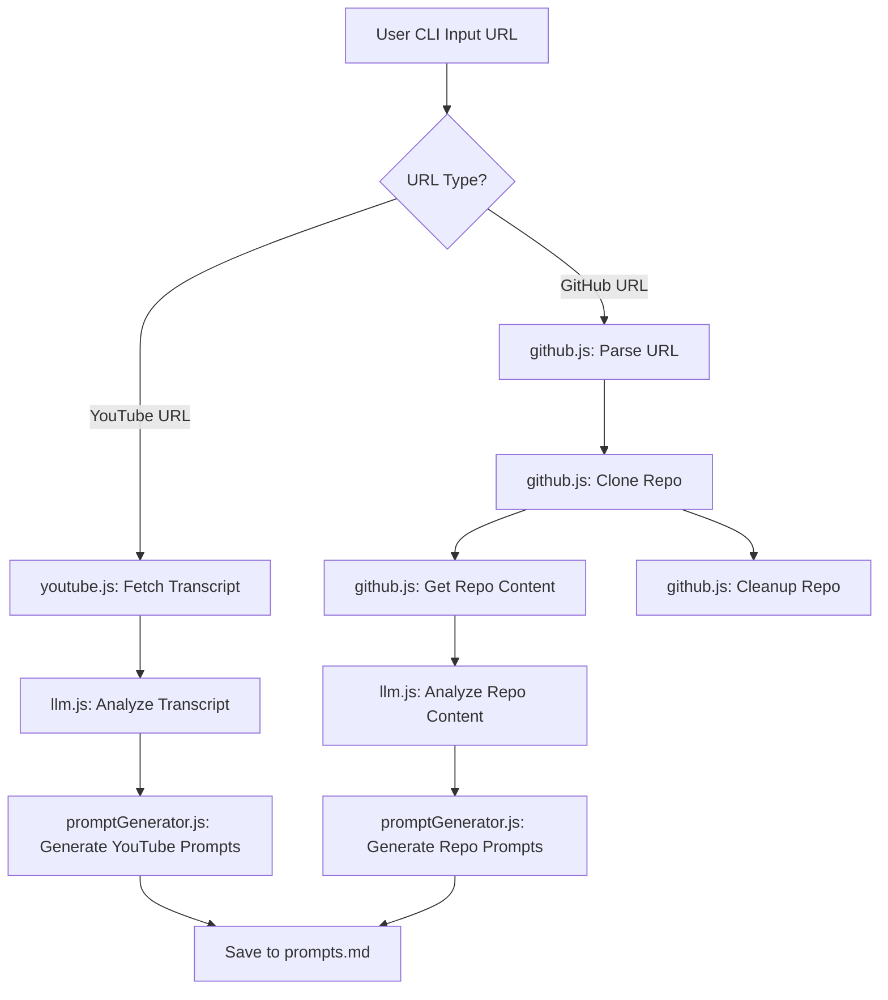

# System Patterns: AI Agent for Content Analysis

## Core Architecture Overview
The AI agent is a Node.js command-line application designed for modularity and extensibility. It processes URLs (YouTube or GitHub) through distinct workflows, interacts with an LLM for analysis, and generates output files.

## Key System Components and Patterns

1.  **Main Agent Logic (`agent.js`):**
    *   **Entry Point:** Initializes the agent and handles the main interaction loop.
    *   **URL Dispatching:** Determines if an input URL is for YouTube or GitHub and routes to the appropriate processing module.
    *   **Orchestration:** Calls functions from other modules in sequence to perform analysis (e.g., `cloneRepo`, `getRepoContentForAnalysis`, `analyzeRepoContent`, `generateRepoPrompts`).
    *   **CLI Interaction:** Uses Node.js `readline` module for asynchronous user input.
    *   **Error Handling:** Implements `try...catch...finally` blocks to manage errors during processing and ensure cleanup.

2.  **GitHub Processing Module (`github.js`):**
    *   **URL Parsing:** Extracts owner and repository name from GitHub URLs.
    *   **Repository Cloning:**
        *   Uses `child_process.exec` (wrapped in `util.promisify` for `execAsync`) to execute `git clone --depth 1` commands.
        *   Creates temporary directories under `ai-agent/temp-clones/` for cloned repositories.
        *   Ensures the base `temp-clones` directory exists.
    *   **Content Extraction (`getRepoContentForAnalysis`):**
        *   Recursively walks the cloned repository.
        *   Prioritizes key files: `README.md` (and variants), `package.json`, `pom.xml`, `pyproject.toml`, `requirements.txt`, etc.
        *   Selects source files from common directories (`src/`, `lib/`, `app/`, `main/`).
        *   Concatenates file content up to defined limits (`MAX_FILE_SIZE`, `MAX_TOTAL_CONTENT_SIZE`) to prepare for LLM analysis.
        *   Skips binary files, `.git` directory, `node_modules`, etc.
    *   **Cleanup (`cleanupRepo`):**
        *   Recursively removes the temporary directory created for the cloned repository using `fs.rm`.

3.  **YouTube Processing Module (`youtube.js`):**
    *   (Existing functionality) Handles fetching YouTube video transcripts, likely via an external service or library.

4.  **LLM Interaction Module (`llm.js`):**
    *   **API Communication:** Uses `node-fetch` (or similar) to make POST requests to the DeepSeek API endpoint.
    *   **Prompt Specialization:**
        *   `analyzeTranscript(transcript)`: Sends transcript content with a prompt tailored for YouTube video summarization.
        *   `analyzeRepoContent(repoContentString)`: Sends concatenated repository content with a prompt tailored for GitHub repository analysis (purpose, features, tech stack, improvements, build strategy).
    *   **API Key Management:** Retrieves `DEEPSEEK_API_KEY` from environment variables.
    *   **Response Handling:** Parses JSON responses from the LLM.
    *   **Parameterization:** Configures LLM parameters like `model`, `max_tokens` (increased for repository analysis), `temperature`.

5.  **Prompt Generation Module (`promptGenerator.js`):**
    *   **Structured Output:** Takes the structured JSON analysis from `llm.js`.
    *   `generateTranscriptPrompts(transcriptAnalysis)`: Creates coding prompts based on YouTube analysis.
    *   `generateRepoPrompts(repoAnalysis)`: Creates coding prompts based on GitHub repository analysis.
    -   Formats these prompts into a Markdown string.

6.  **File System Interaction:**
    *   Uses Node.js `fs` module (e.g., `fs.promises` for async operations).
    *   `mkdir` for creating directories (e.g., `temp-clones`).
    *   `mkdtemp` for creating unique temporary directories for clones.
    *   `writeFile` for saving generated prompts to `prompts.md`.
    *   `readFile` for reading content from cloned repository files.
    *   `rm` for deleting temporary directories.

## Design Patterns
-   **Modular Design:** Functionality is separated into distinct JavaScript modules, promoting maintainability and separation of concerns.
-   **Asynchronous Operations:** Extensive use of `async/await` for non-blocking I/O (file system, network requests, child processes).
-   **Promise-based Error Handling:** Standard `try...catch` for handling errors from asynchronous operations.
-   **Strategy Pattern (Implicit):** Different strategies are applied for YouTube vs. GitHub analysis, orchestrated by `agent.js`.
-   **Temporary Resource Management:** Pattern of creating temporary resources (cloned repos) and ensuring their cleanup in `finally` blocks or dedicated cleanup functions.

## Scalability and Performance Considerations
-   **`git clone --depth 1`:** Used to minimize clone time and data transfer for large repositories.
-   **Content Size Limits:** `MAX_FILE_SIZE` and `MAX_TOTAL_CONTENT_SIZE` in `github.js` prevent overloading the LLM and manage token limits.
-   **Asynchronous Operations:** Help keep the agent responsive while waiting for I/O.
-   The primary bottleneck for GitHub analysis is the `git clone` operation and then the LLM API response time. For YouTube, it's transcript fetching and LLM response time.
